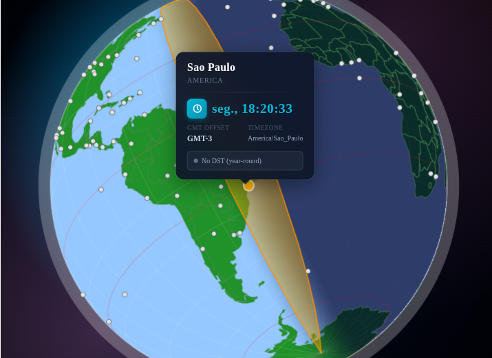
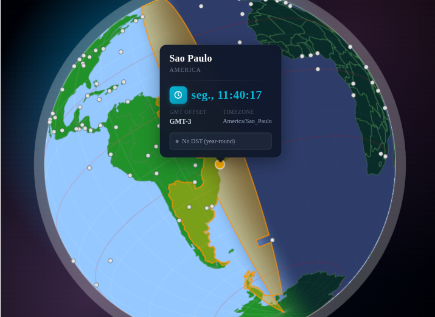
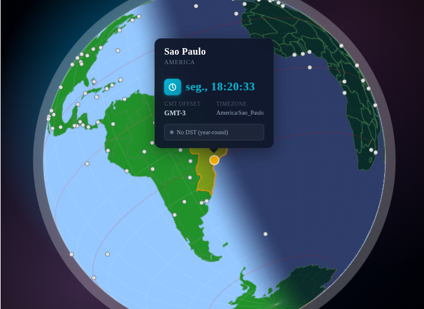

# react-tz-globepicker

[](https://www.npmjs.com/package/@mmerlone/react-tz-globepicker)
[](https://www.npmjs.com/package/@mmerlone/react-tz-globepicker)
[](https://opensource.org/licenses/MIT)

Interactive globe picker for React applications that need timezone selection, timezone visualization, or a compact world-time UI.


Try the [interactive online demo](https://ywybase.vercel.app/demos/react-tz-globepicker).

Created and maintained by [Marcio Merlone](https://mmerlone.dev.br)

## Features

- Drag-to-rotate globe interaction with wheel zoom
- Clickable timezone markers with optional tooltips
- Animated fly-to transitions when the selected timezone changes
- Multiple timezone boundary modes: `none`, `nautic`, `etc-gmt`, and `iana`
- Bundled geodata with no extra runtime setup
- Custom colors, custom backgrounds, controlled zoom, and imperative `ref` methods
- Framework-agnostic styling: no CSS framework required

## Installation

```bash
pnpm add @mmerlone/react-tz-globepicker
# or
npm install @mmerlone/react-tz-globepicker
# or
yarn add @mmerlone/react-tz-globepicker
```

### Peer dependencies

- `react` `^19.0.0`
- `react-dom` `^19.0.0`

## Quick Start

```tsx
import * as React from "react";
import { TzGlobePicker } from "@mmerlone/react-tz-globepicker";

export function App(): React.ReactElement {
  const [timezone, setTimezone] = React.useState<string | null>(
    "America/New_York",
  );

  return (
    <TzGlobePicker
      timezone={timezone}
      size={400}
      onSelect={setTimezone}
      showMarkers
      showTooltips
      showTZBoundaries="etc-gmt"
      showCountryBorders
    />
  );
}
```

## Next.js And Client Components

`TzGlobePicker` is a client component. In Next.js App Router, use it from a file that starts with:

```tsx
"use client";
```

## Boundary Modes

The `showTZBoundaries` prop controls how the currently selected timezone is highlighted.

| Mode      | Best for                            | Behavior                                                      |
| --------- | ----------------------------------- | ------------------------------------------------------------- |
| `none`    | Minimal UI                          | No boundary highlight                                         |
| `nautic`  | Fastest, offset-style visualization | Uses a 15-degree longitude band based on canonical UTC offset |
| `etc-gmt` | Good default                        | Uses merged offset-region geometries                          |
| `iana`    | Highest detail                      | Uses timezone-level IANA boundary data                        |

### Preview

#### Nautic (`nautic`)



#### ETC/GMT (`etc-gmt`)



#### IANA (`iana`)



## Common Patterns

### Use Custom Marker Sets

If you already know which timezones should be selectable, build a marker list once and pass it in. A non-empty `markers` array will render markers even if `showMarkers` is omitted.

```tsx
import * as React from "react";
import { TzGlobePicker, buildMarkerList } from "@mmerlone/react-tz-globepicker";

const allowedTimezones = [
  "America/New_York",
  "Europe/London",
  "Asia/Tokyo",
  "Australia/Sydney",
];

const markers = buildMarkerList(allowedTimezones);

export function TimezonePicker(): React.ReactElement {
  const [timezone, setTimezone] = React.useState<string | null>(
    "America/New_York",
  );

  return (
    <TzGlobePicker
      timezone={timezone}
      onSelect={setTimezone}
      markers={markers}
      showTooltips
      zoomMarkers
      showTZBoundaries="etc-gmt"
      showCountryBorders
      size={360}
    />
  );
}
```

### Use The Built-In Background

```tsx
import * as React from "react";
import { SpaceBackground, TzGlobePicker } from "@mmerlone/react-tz-globepicker";

export function App(): React.ReactElement {
  return (
    <TzGlobePicker
      timezone="America/New_York"
      size={400}
      onSelect={(tz) => console.log(tz)}
      showMarkers
      background={<SpaceBackground />}
    />
  );
}
```

### Control Zoom Externally

```tsx
import * as React from "react";
import { TzGlobePicker } from "@mmerlone/react-tz-globepicker";

export function App(): React.ReactElement {
  const [zoom, setZoom] = React.useState(1);

  return (
    <TzGlobePicker
      timezone="Europe/London"
      zoom={zoom}
      onZoomChange={setZoom}
      minZoom={1}
      maxZoom={5}
      showMarkers
      size={380}
    />
  );
}
```

### Use The Imperative Ref API

```tsx
import * as React from "react";
import {
  TzGlobePicker,
  type TzGlobePickerRef,
} from "@mmerlone/react-tz-globepicker";

export function App(): React.ReactElement {
  const globeRef = React.useRef<TzGlobePickerRef>(null);

  return (
    <div>
      <button
        type="button"
        onClick={() => globeRef.current?.flyTo("Asia/Tokyo")}
      >
        Fly To Tokyo
      </button>

      <button type="button" onClick={() => globeRef.current?.reset()}>
        Reset
      </button>

      <TzGlobePicker
        ref={globeRef}
        timezone="America/New_York"
        showMarkers
        size={360}
      />
    </div>
  );
}
```

## API Reference

### `TzGlobePicker` Props

| Prop                 | Type                                                | Default     | Description                                                      |
| -------------------- | --------------------------------------------------- | ----------- | ---------------------------------------------------------------- |
| `timezone`           | `string \| null`                                    | `null`      | Selected IANA timezone ID such as `"America/New_York"`           |
| `size`               | `number`                                            | `250`       | Globe diameter in pixels                                         |
| `onSelect`           | `(timezone: string) => void`                        | `undefined` | Called when a marker is clicked                                  |
| `showMarkers`        | `boolean`                                           | `false`     | Renders the built-in canonical marker set when `true`            |
| `showTooltips`       | `boolean`                                           | `false`     | Shows marker tooltips on hover                                   |
| `zoomMarkers`        | `boolean`                                           | `false`     | Scales marker size with zoom                                     |
| `minZoom`            | `number`                                            | `1`         | Minimum zoom multiplier                                          |
| `maxZoom`            | `number`                                            | `5`         | Maximum zoom multiplier                                          |
| `initialZoom`        | `number`                                            | `1`         | Initial zoom multiplier                                          |
| `zoom`               | `number`                                            | `undefined` | Controlled zoom value                                            |
| `onZoomChange`       | `(zoom: number) => void`                            | `undefined` | Called when zoom changes                                         |
| `showTZBoundaries`   | `TzBoundaryMode`                                    | `"none"`    | Boundary visualization mode                                      |
| `showCountryBorders` | `boolean`                                           | `false`     | Draws country borders                                            |
| `showGeographic`     | `boolean`                                           | `false`     | Draws equator, tropics, polar circles, and IDL                   |
| `background`         | `string \| React.ReactElement \| null \| undefined` | `undefined` | CSS background string or a background element                    |
| `markers`            | `MarkerEntry[]`                                     | `undefined` | Explicit marker list; a non-empty array enables marker rendering |
| `colors`             | `Partial<GlobePalette>`                             | `undefined` | Partial palette override                                         |
| `style`              | `React.CSSProperties`                               | `undefined` | Inline styles for the outer container                            |
| `className`          | `string`                                            | `undefined` | Class name for the outer container                               |
| `simulatedDate`      | `Date`                                              | `undefined` | Overrides sun position calculations for testing and demos        |

### `TzGlobePickerRef`

```ts
type TzGlobePickerRef = {
  reset: () => void;
  flyTo: (timezone: string, resetZoom?: boolean) => void;
};
```

## Exported Components

```tsx
import {
  ResetButton,
  SpaceBackground,
  TzGlobePicker,
} from "@mmerlone/react-tz-globepicker";
```

- `TzGlobePicker`: main interactive globe component
- `SpaceBackground`: reusable gradient background component
- `ResetButton`: small reset control used internally and available for custom UIs

## Exported Types

```ts
import type {
  Coordinate,
  GeoData,
  GlobePalette,
  GlobeState,
  LatLng,
  MarkerEntry,
  RenderFn,
  Rotation,
  TzBoundaryMode,
  TzGlobePickerProps,
  TzGlobePickerRef,
} from "@mmerlone/react-tz-globepicker";
```

## Exported Constants

```ts
import {
  CLICK_THRESHOLD,
  COLORS,
  DRAG_SENSITIVITY,
  FLY_DURATION,
  GRATICULE_STEP,
  HIT_RADIUS,
  INERTIA_FRICTION,
  INERTIA_MIN_VELOCITY,
  MAX_BOUNDARY_AREA,
  MAX_LATITUDE,
  MAX_ZOOM,
  MIN_ZOOM,
  TILT,
  TZ_BOUNDARY_MODES,
  ZOOM_SENSITIVITY,
} from "@mmerlone/react-tz-globepicker";
```

## Exported Utilities

```ts
import {
  buildMarkerList,
  CANONICAL_MARKERS,
  etcToOffset,
  formatUtcOffset,
  getCanonicalMarkers,
  getSubsolarPoint,
  getTimezoneCenter,
  getUtcOffsetHour,
  getUtcOffsetMinutes,
  IANA_TZ_DATA,
  ianaToEtc,
  mapToCanonicalTz,
  offsetKeyFromEtc,
  TIMEZONE_COORDINATES,
  utcOffsetToLongitude,
  useGlobeState,
} from "@mmerlone/react-tz-globepicker";
```

### Marker Utilities

#### `buildMarkerList(allowed?)`

Builds marker entries from the bundled timezone coordinate map.

```ts
import { buildMarkerList } from "@mmerlone/react-tz-globepicker";

const allMarkers = buildMarkerList();
const subset = buildMarkerList(["America/New_York", "Europe/London"]);
```

#### `getCanonicalMarkers()`

Returns the curated built-in canonical marker list.

```ts
import { getCanonicalMarkers } from "@mmerlone/react-tz-globepicker";

const markers = getCanonicalMarkers();
```

#### `CANONICAL_MARKERS`

Prebuilt marker array that works well as a lightweight default.

```tsx
import {
  CANONICAL_MARKERS,
  TzGlobePicker,
} from "@mmerlone/react-tz-globepicker";

<TzGlobePicker markers={CANONICAL_MARKERS} />;
```

### Timezone Utilities

#### `TIMEZONE_COORDINATES`

Map from IANA timezone ID to approximate `[latitude, longitude]`.

```ts
import { TIMEZONE_COORDINATES } from "@mmerlone/react-tz-globepicker";

const [lat, lng] = TIMEZONE_COORDINATES["America/New_York"] ?? [0, 0];
```

#### `getTimezoneCenter(timezone)`

Returns an approximate `[latitude, longitude]` center, falling back to `[0, 0]` for unknown zones.

```ts
import { getTimezoneCenter } from "@mmerlone/react-tz-globepicker";

const [lat, lng] = getTimezoneCenter("America/Sao_Paulo");
```

#### `getUtcOffsetMinutes(timezone)` and `getUtcOffsetHour(timezone)`

Current UTC offset based on `Intl`.

```ts
import {
  getUtcOffsetHour,
  getUtcOffsetMinutes,
} from "@mmerlone/react-tz-globepicker";

const minutes = getUtcOffsetMinutes("America/New_York");
const hours = getUtcOffsetHour("Asia/Kolkata");
```

#### `mapToCanonicalTz(timezone)`

Maps an IANA timezone to the package's canonical timezone region set.

```ts
import { mapToCanonicalTz } from "@mmerlone/react-tz-globepicker";

const canonical = mapToCanonicalTz("America/Indiana/Indianapolis");
```

#### `ianaToEtc(ianaTimezone)`

Returns the canonical offset key string used by the package, such as `UTC-05:00`.

```ts
import { ianaToEtc } from "@mmerlone/react-tz-globepicker";

const offsetKey = ianaToEtc("America/New_York");
```

#### `offsetKeyFromEtc(etcTimezone)`

Normalizes `Etc/GMT`, `GMT`, or `UTC`-style inputs into canonical `UTC+/-HH:MM` keys.

```ts
import { offsetKeyFromEtc } from "@mmerlone/react-tz-globepicker";

offsetKeyFromEtc("Etc/GMT+5"); // "UTC-05:00"
offsetKeyFromEtc("GMT+05:30"); // "UTC+05:30"
```

#### `etcToOffset(etcTimezone)`

Returns an object containing the normalized ISO-style offset key.

```ts
import { etcToOffset } from "@mmerlone/react-tz-globepicker";

const normalized = etcToOffset("Etc/GMT+5");
// { isoKey: "UTC-05:00" }
```

#### `utcOffsetToLongitude(offsetHours)`

Converts an hour offset to the center longitude of the corresponding offset band.

```ts
import { utcOffsetToLongitude } from "@mmerlone/react-tz-globepicker";

const longitude = utcOffsetToLongitude(-5); // -75
```

#### `IANA_TZ_DATA`

Array of supported canonical IANA timezone identifiers.

```ts
import { IANA_TZ_DATA } from "@mmerlone/react-tz-globepicker";

const firstTimezone = IANA_TZ_DATA[0];
```

### Advanced Hook

#### `useGlobeState`

This hook is exported for advanced integrations. It is not a simple app-level helper; it expects internal rendering refs and controller options similar to the library internals.

## Palette Customization

The `colors` prop accepts a partial `GlobePalette`:

```tsx
import * as React from "react";
import { TzGlobePicker } from "@mmerlone/react-tz-globepicker";

export function App(): React.ReactElement {
  return (
    <TzGlobePicker
      timezone="Europe/London"
      showMarkers
      colors={{
        ocean: "#001f3f",
        land: "#0b6e4f",
        selectedMarker: "#ff6b35",
        highlightFill: "rgba(255, 107, 53, 0.28)",
      }}
    />
  );
}
```

## Data Loading

The package ships with bundled timezone and country data. You do not need to fetch any extra assets in your application.

### Regenerating Globe Data

```bash
pnpm gen:globe
```

This regenerates the artifacts in `src/data/`, including split IANA and ETC/GMT geometry files.

## Development

```bash
pnpm install
pnpm demo
pnpm lint
pnpm type-check
pnpm format
pnpm format:check
pnpm gen:globe
```

## Data Sources

- [Natural Earth 10m Time Zones](https://github.com/nvkelso/natural-earth-vector)
- [visionscarto-world-atlas](https://github.com/visionscarto/world-atlas)
- [timezone-boundary-builder](https://github.com/evansiroky/timezone-boundary-builder)

## License

MIT
