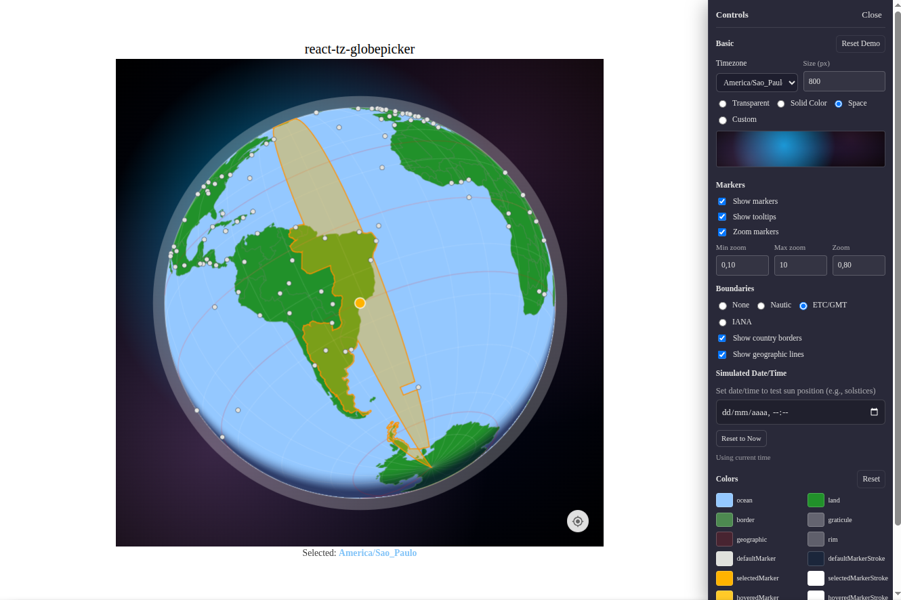

# react-tz-globepicker

[](https://www.npmjs.com/package/@mmerlone/react-tz-globepicker)
[](https://www.npmjs.com/package/@mmerlone/react-tz-globepicker)
[](https://opensource.org/licenses/MIT)

Interactive 3D globe component for timezone selection with React.



## Features

- Interactive 3D globe visualization with drag-to-rotate and zoom
- Clickable timezone markers with hover tooltips
- Animated fly-to transitions when selecting timezones
- Multiple visualization modes (nautic bands, etc-gmt boundaries, iana country-level)
- Bundled timezone data for easy setup

## Installation

```bash
pnpm add react-tz-globepicker
# or
npm install react-tz-globepicker
# or
yarn add react-tz-globepicker
```

## Peer Dependencies

This package requires the following peer dependencies:

- `react` ^18.0.0
- `react-dom` ^18.0.0

## Complete Example

Here's a complete example showing how to use the utilities together, similar to how they're used in production applications:

```tsx
import React, { useState, useEffect } from "react";
import {
  TzGlobePicker,
  buildMarkerList,
} from "react-tz-globepicker";

interface TimezoneOption {
  value: string;
  label: string;
}

// You would typically get this from your own API or timezone utilities
const mockTimezones: TimezoneOption[] = [
  { value: "America/New_York", label: "America/New York (UTC-5)" },
  { value: "Europe/London", label: "Europe/London (UTC+0)" },
  { value: "Asia/Tokyo", label: "Asia/Tokyo (UTC+9)" },
  { value: "Australia/Sydney", label: "Australia/Sydney (UTC+10)" },
];

function TimezoneSelector() {
  const [selectedTimezone, setSelectedTimezone] = useState<string | null>(
    "America/New_York",
  );
  const [timezones, setTimezones] = useState<TimezoneOption[]>([]);
  const [isLoading, setIsLoading] = useState(true);

  useEffect(() => {
    // Load available timezones (you'd typically get this from your own API)
    setTimeout(() => {
      setTimezones(mockTimezones);
      setIsLoading(false);
    }, 500);
  }, []);

  // Generate markers for the globe from available timezones
  const markers = buildMarkerList(timezones.map((tz) => tz.value));

  return (
    <div style={{ display: "flex", gap: "2rem", padding: "2rem" }}>
      {/* Globe Component */}
      <div>
        <h3>Select Timezone on Globe</h3>
        <TzGlobePicker
          timezone={selectedTimezone}
          size={350}
          onSelect={(tz) => setSelectedTimezone(tz)}
          markers={markers}
          showTooltips={true}
          zoomMarkers={true}
          showCountryBorders={true}
          showTZBoundaries="etc-gmt"
        />
      </div>

      {/* Dropdown Selector */}
      <div style={{ minWidth: "300px" }}>
        <h3>Or Select from List</h3>
        <label htmlFor="timezone-select">Timezone</label>
        <select
          id="timezone-select"
          style={{ display: "block", marginTop: "0.5rem", minWidth: "100%" }}
          value={selectedTimezone ?? ""}
          onChange={(event) => {
            setSelectedTimezone(event.target.value || null);
          }}
          disabled={isLoading}
        >
          <option value="">Select your timezone...</option>
          {timezones.map((tz) => (
            <option key={tz.value} value={tz.value}>
              {tz.label}
            </option>
          ))}
        </select>

        {selectedTimezone && (
          <div
            style={{
              marginTop: "1rem",
              padding: "1rem",
              backgroundColor: "#f5f5f5",
              borderRadius: "4px",
            }}
          >
            <strong>Selected:</strong> {selectedTimezone}
          </div>
        )}
      </div>
    </div>
  );
}

function App() {
  return <TimezoneSelector />;
}
```

## Basic Usage

```tsx
import { TzGlobePicker } from "react-tz-globepicker";

function App() {
  const [timezone, setTimezone] = React.useState<string | null>(
    "America/New_York",
  );

  return (
    <TzGlobePicker
      timezone={timezone}
      size={400}
      onSelect={(tz) => setTimezone(tz)}
      showMarkers={true}
      showTooltips={true}
    />
  );
}
```

## Space Background

The package includes a small `SpaceBackground` React component you can pass as the `background` prop to get a starfield-style backdrop.

```tsx
import { TzGlobePicker, SpaceBackground } from "react-tz-globepicker";

function App() {
  return (
    <TzGlobePicker
      timezone="America/New_York"
      size={400}
      onSelect={(tz) => console.log(tz)}
      showMarkers={true}
      background={<SpaceBackground />}
    />
  );
}
```


### Boundary Mode Constants

Use `TZ_BOUNDARY_MODES` to avoid string literals when setting `showTZBoundaries`:

```tsx
import {
  TzGlobePicker,
  TZ_BOUNDARY_MODES,
  type TzBoundaryMode,
} from "react-tz-globepicker";

function App() {
  const [mode, setMode] = React.useState<TzBoundaryMode>(
    TZ_BOUNDARY_MODES.ETCGMT,
  );

  return (
    <TzGlobePicker
      timezone="Europe/London"
      showTZBoundaries={mode}
      onSelect={(tz) => setMode(TZ_BOUNDARY_MODES.IANA)}
    />
  );
}
```

## Data Loading

The component uses bundled timezone data and requires no additional configuration for data loading.

### Updating Globe Data

To update the bundled globe data artifacts, run:

```bash
pnpm gen:globe
```

This will fetch the latest data from Natural Earth and regenerate the files in `src/data/`, including the split IANA and ETC/GMT geometry artifacts.

## API Reference

### TzGlobePicker Props

| Prop                 | Type                                                | Default     | Description                                        |
| -------------------- | --------------------------------------------------- | ----------- | -------------------------------------------------- |
| `timezone`           | `string \| null`                                    | `null`      | IANA timezone identifier (e.g. "America/New_York") |
| `size`               | `number`                                            | `250`       | Globe diameter in pixels                           |
| `onSelect`           | `(timezone: string) => void`                        | -           | Called when a timezone marker is clicked           |
| `showMarkers`        | `boolean`                                           | `false`     | Whether to render timezone markers                 |
| `showTooltips`       | `boolean`                                           | `false`     | Whether to show hover tooltips on markers          |
| `zoomMarkers`        | `boolean`                                           | `false`     | When true, markers scale with zoom level           |
| `showTZBoundaries`   | `'nautic' \| 'etc-gmt' \| 'iana' \| 'none'`          | `'none'`    | Timezone boundary visualization mode               |
| `showCountryBorders` | `boolean`                                           | `false`     | Whether to render country borders                  |
| `markers`            | `MarkerEntry[]`                                     | -           | Optional explicit marker list                      |
| `background`         | `string \| React.ReactElement \| null \| undefined` | `undefined` | Background styling (color, JSX, or transparent)    |
| `colors`             | `Partial<GlobePalette>`                             | -           | Custom color palette override                      |
| `minZoom`            | `number`                                            | `MIN_ZOOM`  | Minimum zoom level                                 |
| `maxZoom`            | `number`                                            | `MAX_ZOOM`  | Maximum zoom level                                 |
| `initialZoom`        | `number`                                            | `1`         | Initial zoom level                                 |
| `style`              | `React.CSSProperties`                               | -           | Optional inline styles for the outer container     |
| `className`          | `string`                                            | -           | Optional CSS class name for the outer container    |

## Exported Components

```typescript
import { TzGlobePicker, SpaceBackground } from "react-tz-globepicker";
```

- `TzGlobePicker`: Main interactive globe component
- `SpaceBackground`: Optional starfield-style background component

## Exported Types

```typescript
import type {
  TzGlobePickerProps,
  TzBoundaryMode,
  GlobeState,
  MarkerEntry,
  Coordinate,
  LatLng,
  Rotation,
  GeoData,
  RenderFn,
} from "react-tz-globepicker";
```

## Exported Constants

```typescript
import {
  TZ_BOUNDARY_MODES,
  COLORS,
  TILT,
  GRATICULE_STEP,
  MAX_BOUNDARY_AREA,
  HIT_RADIUS,
  CLICK_THRESHOLD,
  FLY_DURATION,
  DRAG_SENSITIVITY,
  INERTIA_FRICTION,
  INERTIA_MIN_VELOCITY,
  MIN_ZOOM,
  MAX_ZOOM,
  ZOOM_SENSITIVITY,
  MAX_LATITUDE,
} from "react-tz-globepicker";
```

## Exported Utils

```typescript
import {
  formatUtcOffset,
  getSubsolarPoint,
  getTimezoneCenter,
  getUtcOffsetMinutes,
  getUtcOffsetHour,
  buildMarkerList,
  CANONICAL_MARKERS,
  TIMEZONE_COORDINATES,
  mapToCanonicalTz,
  utcOffsetToLongitude,
  useGlobeState,
} from "react-tz-globepicker";
```

### Utility Functions

#### `buildMarkerList(allowed?)`

Builds a list of timezone markers from coordinate data. Used to generate markers for the globe.

```tsx
import { buildMarkerList } from "react-tz-globepicker";

// Get markers for all timezones
const allMarkers = buildMarkerList();

// Get markers for specific timezones only
const timezones = ["America/New_York", "Europe/London", "Asia/Tokyo"];
const filteredMarkers = buildMarkerList(timezones);

// Example: Generate markers from timezone objects with value property
const timezoneObjects = [
  { value: "America/New_York", label: "New York" },
  { value: "Europe/London", label: "London" },
];
const markers = buildMarkerList(timezoneObjects.map((tz) => tz.value));
```

#### `CANONICAL_MARKERS`

Pre-built subset of markers filtered to canonical timezone regions (~64 entries).

```tsx
import { CANONICAL_MARKERS } from "react-tz-globepicker";

// Use canonical markers for better performance
<TzGlobePicker markers={CANONICAL_MARKERS} />;
```

#### `TIMEZONE_COORDINATES`

Lookup map from IANA timezone ID to approximate [lat, lng] centroid coordinates.

```tsx
import { TIMEZONE_COORDINATES } from "react-tz-globepicker";

const [lat, lng] = TIMEZONE_COORDINATES["America/New_York"] ?? [0, 0];
console.log(`New York is at ${lat}°, ${lng}°`);
```

#### `getUtcOffsetMinutes(timezone)` & `getUtcOffsetHour(timezone)`

Get current UTC offset for a timezone.

```tsx
import { getUtcOffsetMinutes, getUtcOffsetHour } from "react-tz-globepicker";

const offsetMinutes = getUtcOffsetMinutes("America/New_York"); // -300 or -240 (DST)
const offsetHours = getUtcOffsetHour("Asia/Kolkata"); // 5.5
```

#### `mapToCanonicalTz(timezone)`

Map any IANA timezone to its canonical timezone-boundary-builder region.

```tsx
import { mapToCanonicalTz } from "react-tz-globepicker";

const canonical = mapToCanonicalTz("America/Indiana/Indianapolis");
// Returns: 'America/New_York'
```

#### `utcOffsetToLongitude(offset)`

Convert UTC offset to longitude center.

```tsx
import { utcOffsetToLongitude } from "react-tz-globepicker";

const longitude = utcOffsetToLongitude(-5); // -75 (Eastern US)
```

## Development

```bash
# Install dependencies
pnpm install

# Run linting
pnpm lint

# Run type checking
pnpm type-check

# Format code
pnpm format

# Format check
pnpm format:check

# Update globe data
pnpm gen:globe
```

## License

MIT

## Data Sources

This package uses high-quality, open geodata from:

- [Natural Earth 10m Time Zones](https://github.com/nvkelso/natural-earth-vector): authoritative, closed-polygon timezone boundaries. See [ne_10m_time_zones.geojson](https://github.com/nvkelso/natural-earth-vector/blob/master/geojson/ne_10m_time_zones.geojson).
- [visionscarto-world-atlas](https://github.com/visionscarto/world-atlas): simplified world country boundaries (110m resolution).

Data is downloaded and processed automatically by the `pnpm gen:globe` script. See `scripts/update-globe-data.ts` for details.
